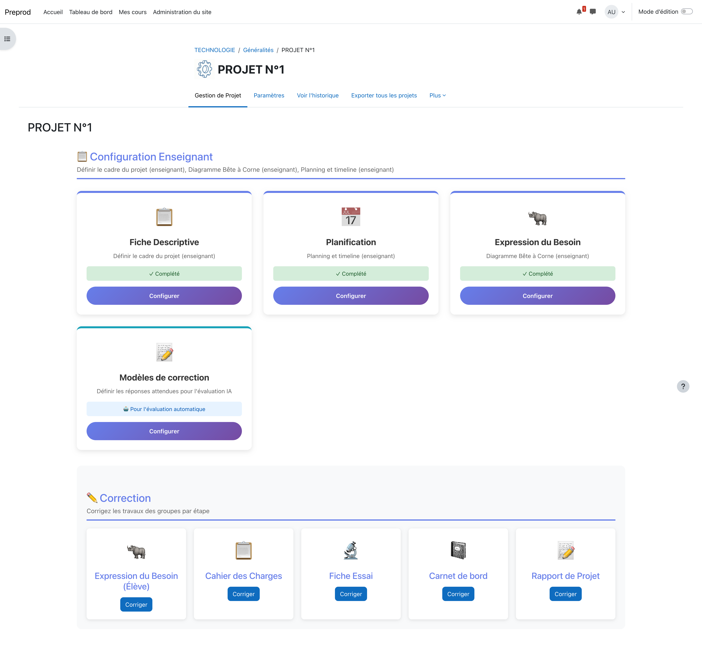

# Plugin Gestion de Projet pour Moodle

Plugin Moodle de gestion de projet pédagogique en 8 phases pour l'enseignement de la technologie au collège.

## Description

Ce plugin permet aux enseignants de guider leurs élèves à travers un projet technologique structuré en 8 étapes :

1. **Description du projet** (Enseignant) - Présentation du contexte et des objectifs
2. **Analyse du besoin** (Enseignant) - Définition du besoin et des contraintes
3. **Planning** (Enseignant) - Timeline interactive avec gestion des vacances scolaires
4. **Cahier des charges fonctionnel** (Élève) - Rédaction du CdCF avec interacteurs
5. **Essais et validation** (Élève) - Documentation des tests et résultats
6. **Rapport de projet** (Élève) - Synthèse du travail réalisé
7. **Analyse fonctionnelle** (Élève) - Diagrammes et analyse des fonctions
8. **Carnet de bord** (Élève) - Suivi chronologique du projet

## Fonctionnalités principales

- **Sauvegarde automatique** - Les travaux sont sauvegardés automatiquement
- **Mode groupe ou individuel** - Support des travaux collaboratifs
- **Évaluation par IA** - Évaluation automatique des productions avec Albert (IA française Etalab)
- **Modèles de correction** - L'enseignant définit ses critères d'évaluation
- **Intégration au carnet de notes** - Notes synchronisées avec le gradebook Moodle
- **Timeline interactive** - Planning visuel avec intégration des vacances scolaires (zones A/B/C)
- **Dates de rendu** - Gestion des échéances avec indicateurs visuels

## Prérequis

- Moodle 4.1+ (testé jusqu'à Moodle 5.0)
- PHP 8.1+

## Installation

1. Téléchargez le dossier `mod_gestionprojet`
2. Placez-le dans le répertoire `/mod/` de votre installation Moodle
3. Connectez-vous en tant qu'administrateur
4. Accédez à Administration > Notifications pour finaliser l'installation
5. Purgez les caches si nécessaire

Pour plus de détails, consultez [INSTALLATION.md](INSTALLATION.md).

## Configuration de l'IA

Le plugin intègre **Albert**, l'IA souveraine française développée par Etalab. Cette IA est préconfigurée et ne nécessite aucune clé API.

Autres providers supportés (nécessitent une clé API) :
- OpenAI (GPT-4)
- Anthropic (Claude)
- Mistral AI

## Captures d'écran

### Accueil et navigation

*Page d'accueil de l'activité avec navigation vers les différentes phases*

*Tableau de bord enseignant pour le suivi des élèves*

### Configuration

*Configuration des phases activées pour le projet*

*Choix du mode de soumission (groupe ou individuel)*

### Modèles de correction (Enseignant)

*Hub centralisant tous les modèles de correction*

*Exemple de modèle de correction pour le cahier des charges fonctionnel*

### Évaluation par IA

*Vue d'une activité élève avec correction automatique*

*Synthèse générée par l'IA pour l'évaluation*

## Utilisation

### Pour l'enseignant

1. Créez une activité "Gestion de projet" dans votre cours
2. Configurez les paramètres (mode groupe, phases activées, etc.)
3. Remplissez les phases enseignant (1, 2, 3)
4. Définissez les modèles de correction pour les phases élèves
5. Suivez les soumissions et évaluez les travaux

### Pour l'élève

1. Accédez à l'activité depuis le cours
2. Complétez les phases qui vous sont assignées (4 à 8)
3. Vos travaux sont sauvegardés automatiquement
4. Soumettez chaque phase une fois terminée

## Documentation

- [INSTALLATION.md](INSTALLATION.md) - Guide d'installation détaillé
- [ROADMAP.md](ROADMAP.md) - Plan de développement et fonctionnalités prévues
- [mod_gestionprojet/README.md](mod_gestionprojet/README.md) - Documentation technique du plugin

## Version

**Version actuelle** : 1.7.0 (2026012900)

## Licence

GPL v3 - Ce plugin est un logiciel libre.

## Auteur

**REMY Emmanuel**

## Support

Pour signaler un bug ou proposer une amélioration, utilisez les issues du dépôt GitLab.
